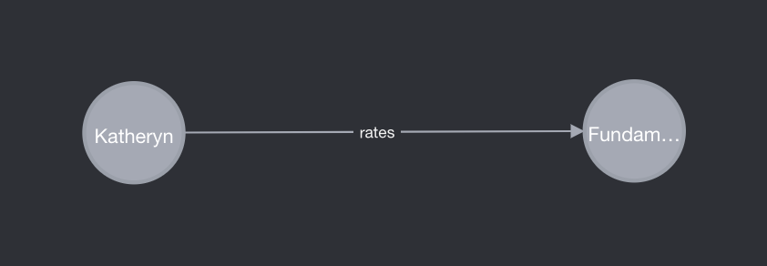
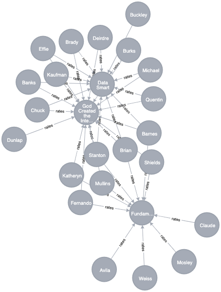
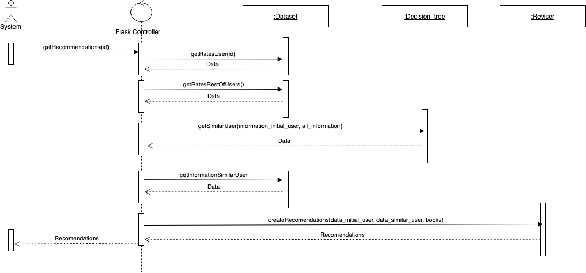

# Technical Test
## Information about the App

This app has been created with the purpose of giving recommendations in the context of a book business.

The requirements are to crete a recommender system that recommend book that have not been red to users.
This recommender system is made by:
* Neo4j Graph Database
* Recommender system 
* Flask Python REST API

The GRAPH database is composed with over 4000 relations in the form of the graph.

(USER)-[rates{score}]->(Book)

This structure is shown in the graph below with only one relation and with a bigger graph:




Create more relations and more nodes were discarded because they were not going to be used for the API purpose.

In more detail, the recommender system performs in this way. 
The RS looks for the rating of the initial user, by using of a Decision Tree it finds the more similar user and his ratings.
Then, the case-based reasoning system find the books that are better fitted in terms of this similarity to the other user, giving 10 new books to read.
These 10 books are reached by classifiying the initial user by its rates in a group of users and get a user with the similar likes, these are the parts of Retrieval and Reuse in the Recommender system.
Then the reviser look for the best books for this user and they are give. To get more wisdom rates can be given to the system by a POST method.

This behaviour is explained in this sequence diagram:




Create more relations and more nodes were discarded because they were not going to be used for the API purpose.

## To Setup and Start the project
### Project Requirements
* The pyhton version required is version 3.8
* Neo4j Desktop has to be installed (https://neo4j.com/download/)
* Project in Neo4j Desktop has to be created
* DBMS needs to be set up
* Import the CSV files in the neo4j project located in ./data in the project structure

To load the data in de database, a script has been given for this purpose.
This script load the data in the CSV files provided to create the nodes an the relationships between them.

In order to connect the DB with the backend you have modify the config file in /config/config.dat with the parameters os your connection specified in Neo4j desktop

Once these requirements are satisfied, we can proceed to run the app

### Run the App
```bash
virtualenv flask
flask/bin/pip install flask
flask/bin/pip install -r requirements.txt 
./app.py
```
This will run the server and it will start listening in

http://127.0.0.1:5000/

## API Requests

### Get All Users
To get all users stored in the Application you have to introduce this url in the browser

http://127.0.0.1:5000/todo/api/v1.0/users

```bash
http://127.0.0.1:5000/todo/api/v1.0/users
```

### Get All Books
To get all books stored in the Application you have to introduce this url in the browser

http://127.0.0.1:5000/todo/api/v1.0/books

```bash
http://127.0.0.1:5000/todo/api/v1.0/books
```

### Get ratings by user
To get all ratings introduced by a user this url needs to be introduced in the browser

http://127.0.0.1:5000/todo/api/v1.0/rates/5

Where 5 is the id of the user, this number is between 1 and 40 as there are 40 users stored in the app

```bash
http://127.0.0.1:5000/todo/api/v1.0/rates/{id}
```

### Create a new rate
To introduce a new rate we have to make a post to the api in this url

http://127.0.0.1:5000/todo/api/v1.0/rate

With the JSON specified below, as an example

```bash
http://127.0.0.1:5000/todo/api/v1.0/rate

{
  "book": "Analysis, Vol I",
  "name": "Chuck",
  "score": 5
}
```

### Get personalized recommendations for a user
To get recommendations for a specific user, this url needs to be introduced in the browser

http://127.0.0.1:5000/todo/api/v1.0/recommended-books/5

Where 5 is the id of the user, this number is between 1 and 40 as there are 40 users stored in the app

```bash
http://127.0.0.1:5000/todo/api/v1.0/rates/recommended-books/{id}
```

## Swagger
The swagger specification of the API, can be found in the URL

http://127.0.0.1:5000/todo/api/v1.0/swagger